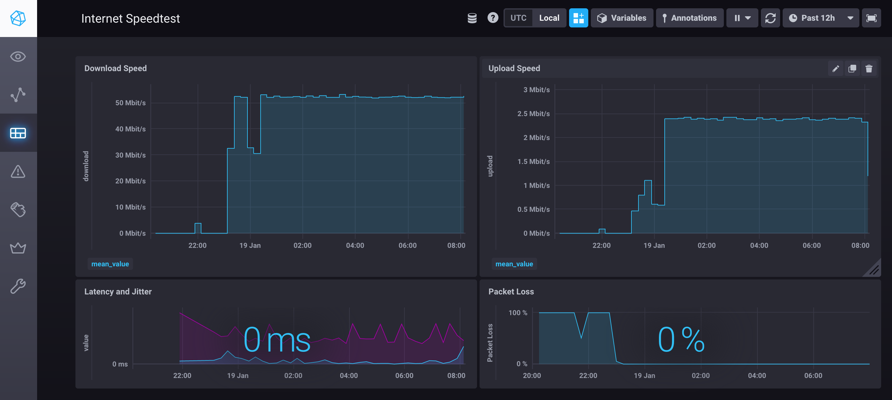

# Internet Speedtest with Docker

Modified from

> Run [Ookla's speedtest CLI](https://www.speedtest.net/de/apps/cli) to regularly test your local internet connection 
> from a [Docker](https://docs.docker.com/) ARMv7 compatible container.
> The results of the speed test are intended to be forwarded to an [InfluxDB](https://docs.influxdata.com/) and visualized
> in a [Chronograf](https://docs.influxdata.com/chronograf) dashboard.

This project is inspired and based on [thinkonezero/docker-speedtest](https://gitlab.com/phikai/docker-speedtest).
Thank you very much for the work you put in, paving the way for this project.

## Prerequisites
* Docker
* 

## Usage

1. `git clone git@github.com:sthuber90/docker-speedtest.git`
2. `docker-compose up -d`
3. Open Chronograf http://localhost:8888
4. Import dashboard
5. Now, you can access the dashboard under http://localhost:8888/sources/0/dashboards/1

### Chronograf
Visualizes the stored data in a dashboard.

| Variables | Default | Function |
|-----------|---------|----------|
| INFLUXDB_URL| http://influxdb:8086 | URL to query InfluxDB. Port in URL must match the port of the InfluxDB container. |

For further information refer to the [official image](https://hub.docker.com/_/chronograf)

### InfluxDB
Stores the speed test data:
* download speed (Mbit/s), 
* upload speed (Mbit/s),
* latency (ms), 
* jitter (ms), 
* packet loss (%)

By default, the data is stored for 7 days. If you want to change it, you have to change the default retention policy through 
the Chronograf UI.

| Variables | Default | Function |
|-----------|---------|----------|
| INFLUXDB_DB| speedtest | Database table to store the speed test results in. MUST be the same table name provided to the SpeedTest container. |

Read the [official docs](https://hub.docker.com/_/influxdb) for further environment variables available

### Speedtest
Image is based on Alpine Linux and available via [Docker Hub](https://hub.docker.com/r/sthuber90/speedtest/) as `sthuber90/speedtest`.

It gets built through [GitHub Actions](https://github.com/features/actions) from [this Dockerfile](Dockerfile).

If, for whatever reason, the speed test fails or gets aborted - in case there has been no response received within 5 minutes -
the script will classify that as "no internet connection is available". In this case, the script will store 0 Mbit/s for 
the download and upload speed and 100% packet loss in the InfluxDB. For latency and jitter no values get written to the InfluxDB in this case.

| Variables | Default | Function |
|-----------|---------|----------|
| INFLUXDB_DB| speedtest | Database table to store the speed test results in. MUST be the same table name provided to the InfluxDB container. |
| TEST_INTERVAL | 900 | Time in seconds until the speed test script is run again. Default is 15 minutes. May not be smaller than 5 minutes. |

## Contribution
Contributions are welcome. Please follow these steps:
1. Open an [issue](), detailing what is missing or now working. 
1. Fork this repository 
1. Create a branch: `git checkout -b <branch_name>. 
1. Make your changes and commit them: `git commit -m '<commit_message>'`
1. Push to the original branch: `git push origin <project_name>/<location>
1. Create the pull request.`

## ⚠️ Disclaimer
The results of the speed test will vary, depending on what else is going on in your network. Such as other downloads, uploads, 
or streams taking place within your network during a test.

Take note, that running the _speedtest_ container means, that you accept the Speedtest CLI's [license](docs/speedtest-license.md) 
and [privacy regulations](docs/speedtest-privacy.md). 
